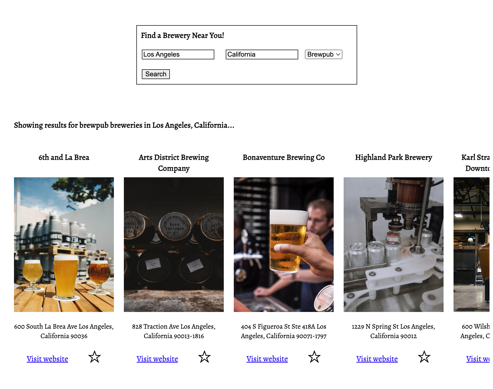
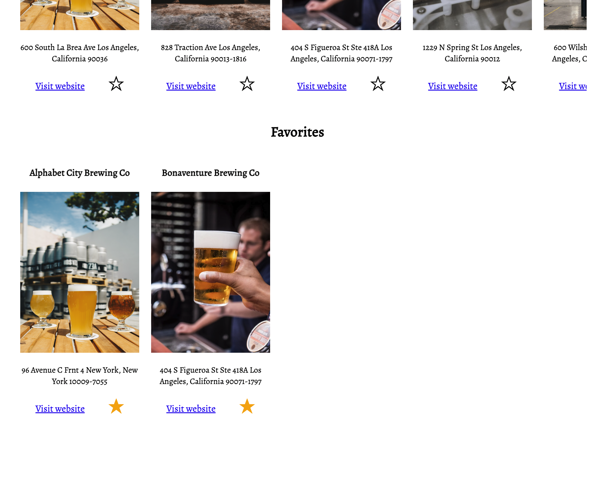

# Brew Hub

Team Members: Kaeli Gilmore, Jordan Jennings, Lucy Tittle
Phase 1 - 080822 East B 

Brew Hub is a one page app that uses a public API to search for breweries in a designated area. The page is built with HTML, CSS, and Javascript. 

The main functionality is built using a fetch request. The user has the ability to search by city and state, and type of brewery. The API returns up to 10 breweries with their name, address, and website. 




</br>

The user is able to click the star ☆ to save that brewery to their favorites using a POST request. We are replicating a backend server by using json-server. The favorites are saved in the db.json file. Favorite breweries can be deleted as well by clicking on the star again using a DELETE request and removing it from db.json.




## Try Brew Hub

To test Brew Hub for yourself, clone this repository to your local computer. 
```
$ npm install -g json-server
$ cd brew-pub
$ json-server --watch db.json
```

To check out the API documentation: https://www.openbrewerydb.org/documentation

